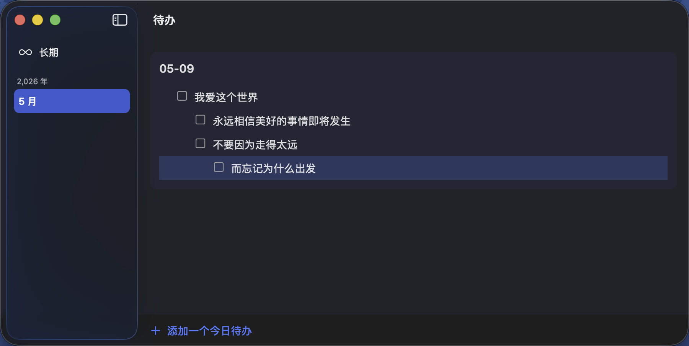

# Todo Block

[中文](README.md) | [English](README.en.md)

Todo Block 是一个原生 macOS 待办应用，支持分层任务、键盘优先操作、菜单栏快速查看，以及按日期整理任务。

## 截图



## 功能特点

- 原生 macOS 体验：SwiftUI 外壳、AppKit 编辑器、SwiftData 本地存储
- 分层任务：支持最多 4 层子任务
- 键盘优先：创建、编辑、移动任务都可以直接用键盘完成
- 日期分组：任务按日期自动归类，分区标题可编辑
- 菜单栏入口：不切换窗口也能快速查看今天的待办
- 拖拽排序：支持列表内和列表间拖拽整理
- 多选操作：支持 `Shift + 点击` 范围选择和左键长按拖选
- 实时同步：菜单栏和主窗口内容保持同步
- 撤销重做：常见操作支持撤销和重做
- 长期任务：支持长期事项分桶管理

## 下载

- 最新版本页面：[GitHub Releases](https://github.com/keru-s/todo-block/releases/latest)
- 直接下载：[Todo-Block-macOS.zip](https://github.com/keru-s/todo-block/releases/latest/download/Todo-Block-macOS.zip)

### 首次打开会被 Gatekeeper 拦截

本项目的发布包是 **ad-hoc 签名**（未走 Apple 付费开发者证书 + 公证），所以首次打开 macOS 会提示"无法验证开发者"或"应用已损坏"。这不影响功能和数据，按以下任一方式放行即可：

**方式 A（推荐）**：终端执行下面这条命令移除浏览器打的隔离标记，之后正常双击打开：

```bash
xattr -dr com.apple.quarantine "/Applications/todo block.app"
```

**方式 B**：在"应用程序"里**右键点击**（或按住 Control 点击）`todo block.app` → 选"打开" → 在弹窗里再点一次"打开"。首次确认后系统会记住选择，以后双击即可。

**方式 C**：第一次双击被拦截后，打开"系统设置 → 隐私与安全性"，下滑找到"已阻止 todo block"，点"仍要打开"。

## 运行要求

- 系统：macOS 15.7 或更高版本
- 开发：Xcode 26.0 或更高版本

## 安装与运行

### 直接安装

1. 从 Releases 下载压缩包。
2. 解压后把 `todo block.app` 拖到“应用程序”文件夹。
3. 首次打开如果遇到系统拦截，先执行上面的终端命令，再重新打开。

### 从源码运行

```bash
git clone https://github.com/keru-s/todo-block.git
cd todo-block
open "todo block.xcodeproj"
```

打开后在 Xcode 中直接运行即可。

### 命令行构建

```bash
xcodebuild -project "todo block.xcodeproj" \
  -scheme "todo block" \
  -destination 'platform=macOS' \
  build
```

## 快捷键

| 快捷键 | 作用 |
|--------|------|
| `Enter` | 在当前任务下方新建任务 |
| `Backspace` | 删除空任务 |
| `Tab` | 增加缩进 |
| `Shift+Tab` | 减少缩进 |
| `↑` / `↓` | 在任务间移动 |
| `⌘↑` / `⌘↓` | 上移或下移任务 |
| `Space` | 切换完成状态 |
| `Shift+Click` | 范围多选 |
| 左键长按拖动 | 连续多选 |
| `⌘Z` | 撤销 |
| `⌘⇧Z` | 重做 |
| `⌘C` | 复制任务 |
| `⌘V` | 粘贴任务 |

## 项目结构

```text
todo block/
├── Models/         # 数据模型
├── Services/       # 存储、撤销、剪贴板、排序、选择等核心逻辑
├── Views/
│   ├── AppKitEditor/ # 待办编辑器
│   ├── Main/       # 主窗口
│   ├── MenuBar/    # 菜单栏界面
│   └── Shared/     # 共享样式和预览支持
└── todo_blockApp.swift
```

## 开发

### 运行测试

```bash
xcodebuild test \
  -project "todo block.xcodeproj" \
  -scheme "todo block" \
  -destination 'platform=macOS' \
  -parallel-testing-enabled NO \
  -only-testing:"todo blockTests"
```

### 发布打包

正式发布通过推送 `v` 开头的标签触发，例如：

```bash
git tag v0.1.0
git push origin main v0.1.0
```

触发后，GitHub Action 会自动构建 Release 版本、生成 `Todo-Block-macOS.zip`，并把它挂到 GitHub Release 页面。

如果只是想先试跑打包流程，也可以在 GitHub Actions 页面手动运行工作流。手动运行会生成下载产物，但不会创建正式 Release。

## 技术栈

- Swift 6.2
- SwiftUI
- AppKit
- SwiftData
- `@Observable`

## 许可证

MIT
